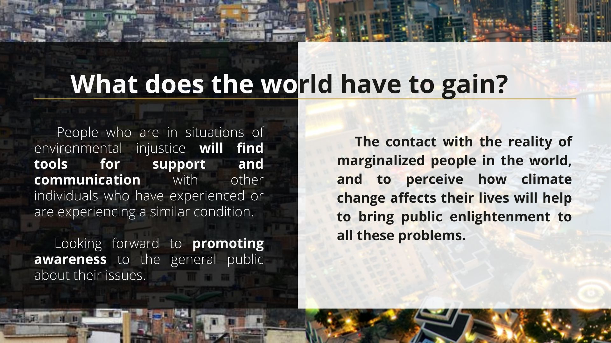
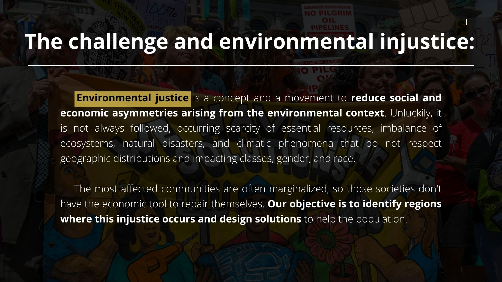
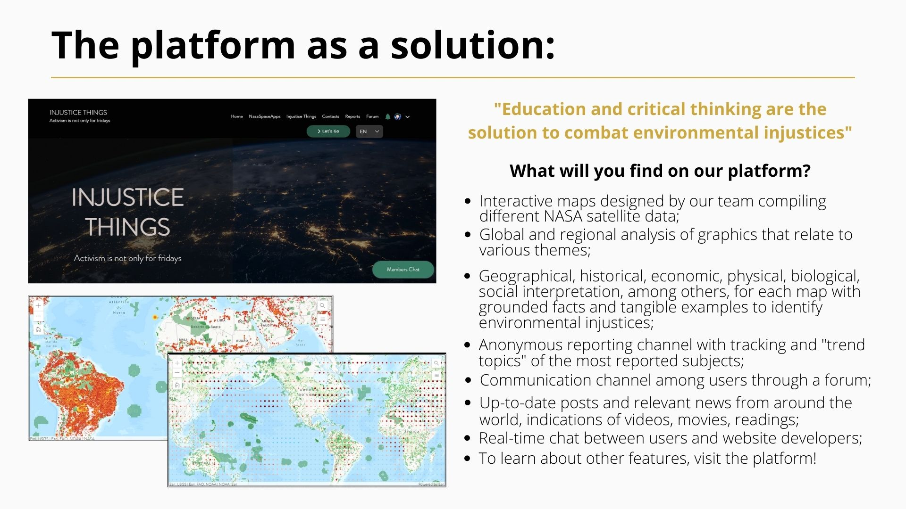

# injustice-things
A background website developed for the NASA Space Apps Challenge 2021 Hackathon. This project was developed as a team, and it owes its success to the team formed by incredible people (Luísa Lôbo Pimentel, Alexia Paes, Stéfany Coimbra, Bruno Said). I also thank the organization.

https://user-images.githubusercontent.com/86388642/199799764-13605e4d-1b3d-4fdc-a1cd-4674c615b67a.mov

## Slide Injustice Things

  
  
  
  
  
  
  

## PITH Moinho Lab

  
  
  
  
  
  
  
  
  

